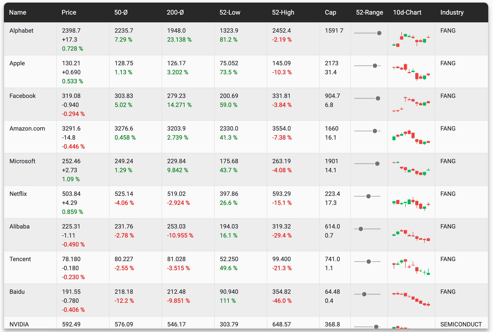
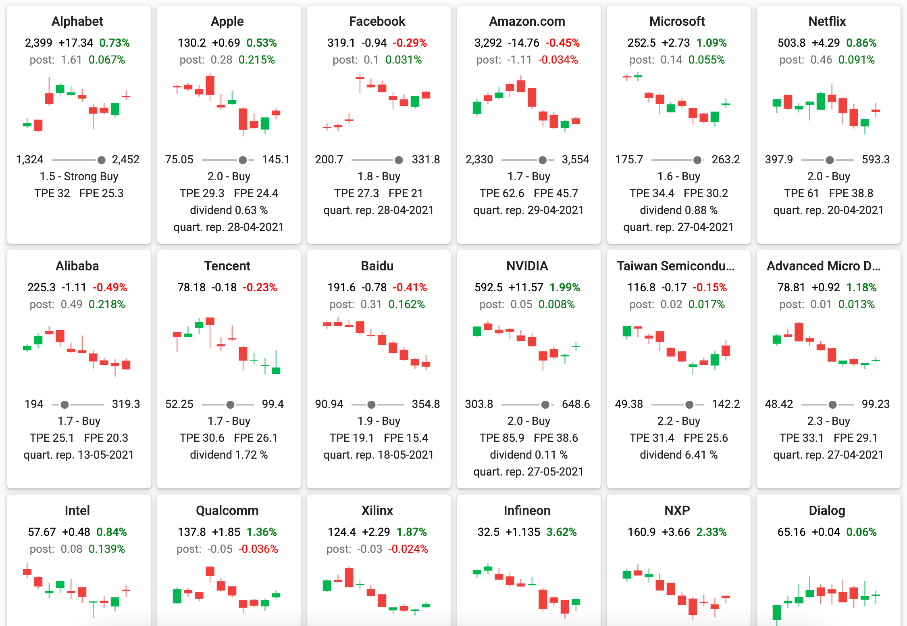
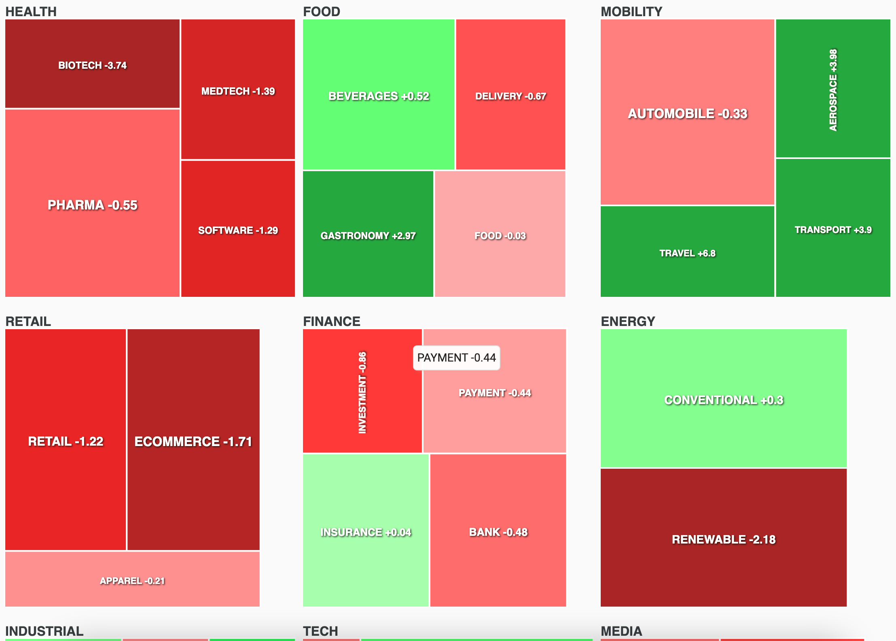

<h1 align="center"> Welcome to the Stonk-Platform </h1>

<h3 align="center"> Technology Stack </h3>
<div align="center">
	
  	
  	 
  	
  	  
  	
  	
  	
</div>

#

[Live-Demo](http://47.91.78.219:3000)


#








---

## How To Run
### Run on local machine with docker
Install docker.
Build the api service with ```mvn clean install```
in api directory.  
Build the web app with ```ng build --prod```
in web directory.  
Create Docker images with ```docker-compose``` in project root.  
Create docker containers and run them with ```docker run```.


### Run on local machine in debug mode
Start api service by run ```StonkMonitorApp```. Start web app with ```ng serve``` in the web directory.

## API Specification

```
/quote/{symbol}
```

**GET** single quote symbol data  
**Param**: ```symbol=[alphanumeric]```

---
```
/stream/quotes/{industry}
```  

**GET** stream of all industry specific quotes  
**Param:** ```industries:[INDICES, TECH, HEALTH, INDUSTRIAL, MEDIA, MOBILITY,
FINANCE, FOOD, RETAIL, ENERGY]```

---
```
/stream/quotes/{industry}/{category}
```  

**GET** stream of subindustry quotes  
**Param**: ```categories:[ETF, FANG, MANUFACTURING, SEMICONDUCTOR, ECOMMERCE,
SOFTWARE, CLOUD, SAAS, SECURITY, FOOD, GASTRONOMY, MATERIALS,
CHEMICALS, TELECOMMUNICATION, REALESTATE, PHARMA, MEDTECH, BIOTECH,
DELIVERY, APPAREL, SPORTS, CONVENTIONAL, RENEWABLE, AKKU, AEROSPACE,
TRAVEL, AUTOMOBILE, PAYMENT, BANK, EXCHANGE, RENTAL, RECYCLING,
GAMES, TELEVISION, MUSIC, CHINA, CONSUMER, SERVICES, OTHER,
SHIPPING]```

---
```
/stream/quotes/{industry}/{page}
```   

**GET** stream of industry quotes with paging  
**Param**: ```page=[integer]```

---
```
/stream/quotes/{industry}/{page}?{sortProperty}&{sortDirection}
```

**GET** stream of sorted industry quotes with paging:  
**Param**: ```sortProperties:=[name, dayChangePercent, fiftyDayAverageChangePercent,
twoHundredDayAverageChangePercent, fiftyTwoWeekLowChangePercent, fiftyTwoWeekHighChangePercent, marketCap]```  
**Param**: ```sortDirection:[ascending, descending]```


